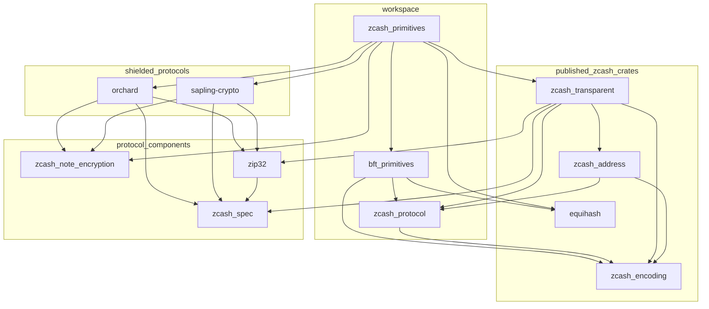

# Zcash Rust crates

This repository contains Rust crates for working with Zcash Crosslink,
including BFT consensus data and staking transactions.

⚠️ IMPORTANT: The only way to check Zcash consensus validity is to use a Zcash
consensus node. ⚠️

The public API surfaces of these crates include many APIs that are used by the
zcashd and Zebra node implementations, as well as other critical components in
the Zcash ecosystem, but none of them expose any way to check consensus validity
of transactions. In particular, APIs for parsing transactions only check a subset
of validity constraints. The specific subset they check is not sufficient to
guarantee any meaningful user-level validity constraints, and is not necessarily
stable over time, or consistent with other implementations of parsers for Zcash
transactions.

<!-- START mermaid-dependency-graph -->

<!-- END mermaid-dependency-graph -->

## Workspace crates

* `zcash_protocol`: Network constants and common protocol types
  - consensus parameters and network upgrades, including Crosslink
  - bounded value types and memos
  - staking timing parameters
* `bft_primitives`: Crosslink BFT data types
  - BFT blocks, votes, fat pointers, hard forks, and staking rosters
  - canonical binary encoding and signature verification
* `zcash_primitives`: Transaction construction and serialization
  - legacy and VCrosslink transaction formats
  - BFT references in block headers
  - staking actions and transaction builder support
  - transparent, Sapling, and Orchard transaction components

## Security Warnings

These libraries are under development and have not been fully reviewed.

## License

All code in this workspace is licensed under either of

 * Apache License, Version 2.0, ([LICENSE-APACHE](LICENSE-APACHE) or http://www.apache.org/licenses/LICENSE-2.0)
 * MIT license ([LICENSE-MIT](LICENSE-MIT) or http://opensource.org/licenses/MIT)

at your option.

### Contribution

Unless you explicitly state otherwise, any contribution intentionally submitted
for inclusion in the work by you, as defined in the Apache-2.0 license, shall
be dual licensed as above, without any additional terms or conditions.
